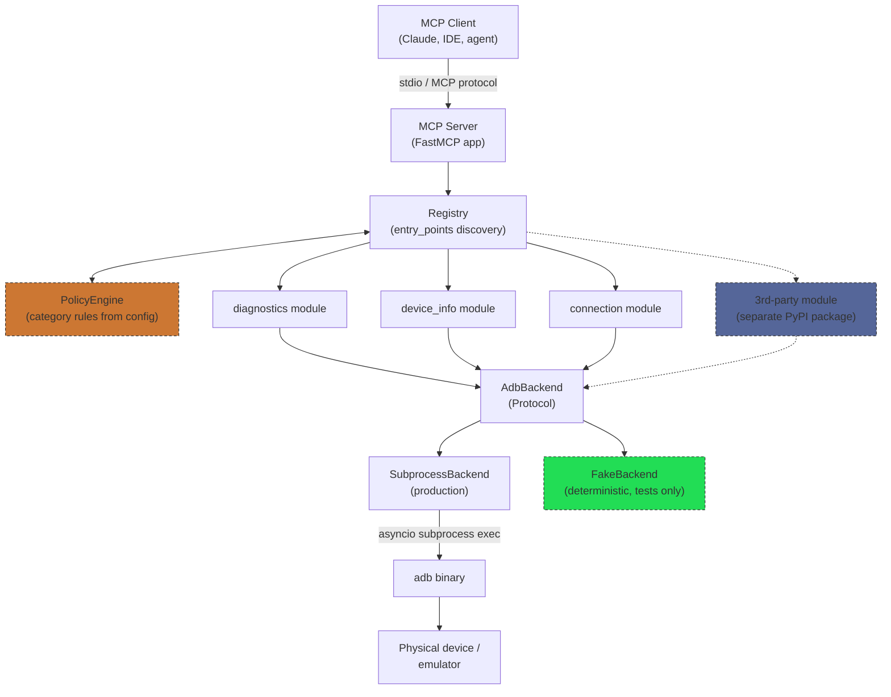
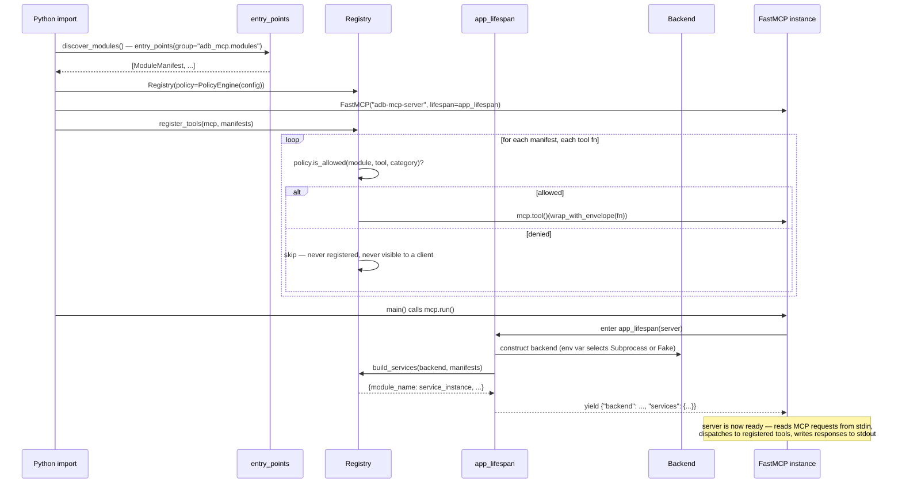
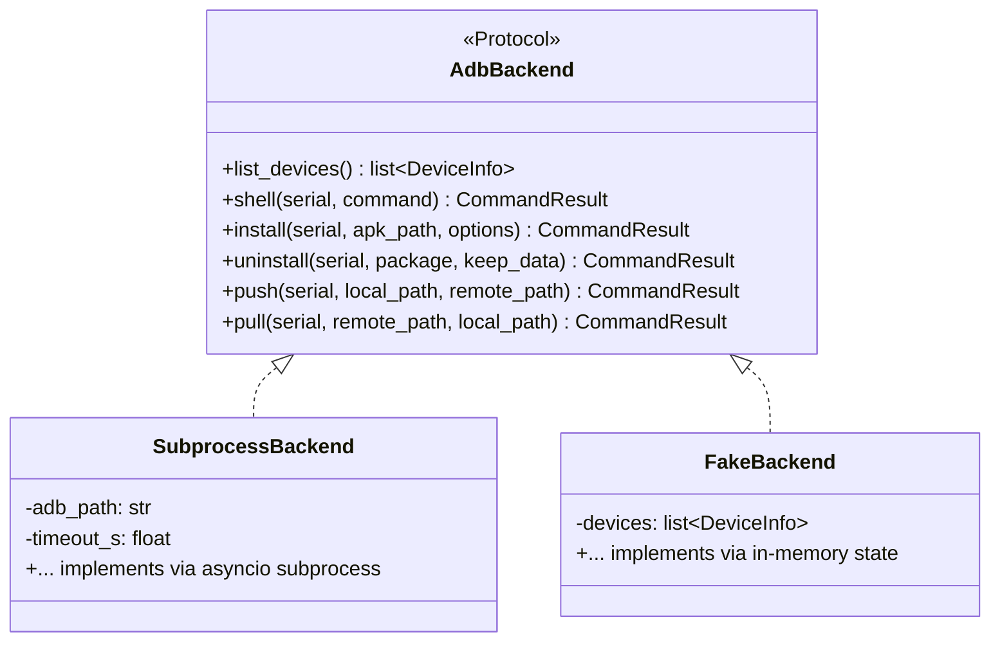
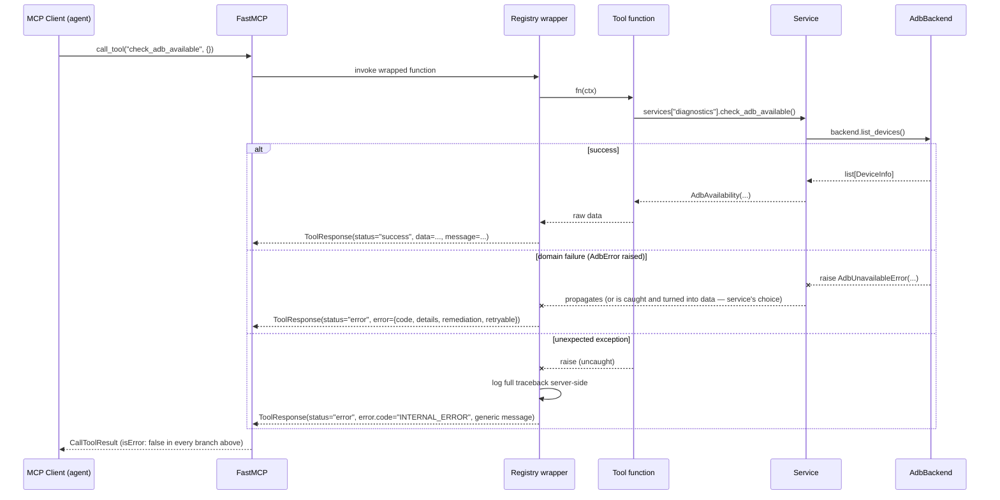
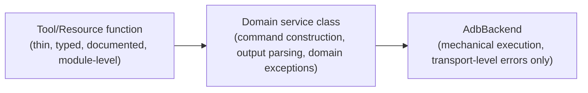
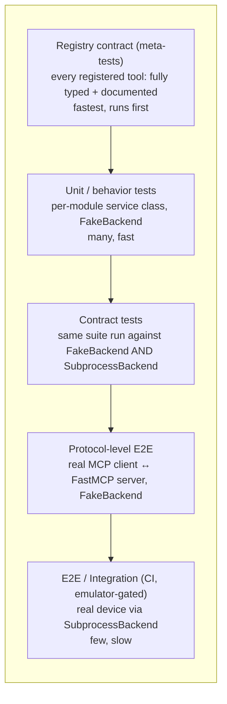
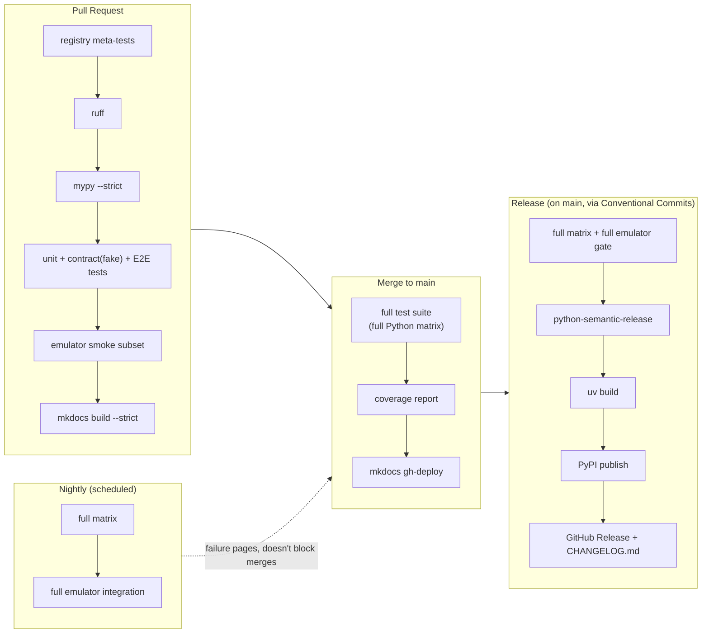

# ADB MCP Server — Architecture

This describes the system as it currently stands: what exists, how a process boots,
and how the pieces work together. It does not explain *why* things are shaped this
way — for that, see `ADR.md`, the decision log.

Last updated: 2026-08-25

## 1. Overview

An MCP server that exposes Android Debug Bridge (ADB) capabilities to MCP clients
(Claude, other agents/IDEs) as typed, documented **tools** (actions) and **resources**
(readable state).

**Goals:**
- Every behavior is verifiable without a physical device or emulator.
- New command domains can be added as plugins, by third parties, without forking.
- Operable like a real open-source project: semantic versioning, automated releases,
  documented architecture, a PR workflow contributors can actually follow.

**Non-goals (v1):**
- A pure-Python re-implementation of the ADB wire protocol.
- Multi-transport MCP support (HTTP/SSE) — ships `stdio` only.
- A generic "run arbitrary shell command" tool in core.
- Per-user or per-identity RBAC. The policy layer governs which tools exist at all on
  a given server instance, not who is calling it.

**Current implementation status (2026-08-25):** three modules exist under
`src/adb_mcp/modules/`: `diagnostics` (`check_adb_available`), `device_info`
(`list_connected_devices`), and `connection` (`restart_adb_server`). It passes
`mypy --strict`, `ruff`, `pytest`, and has been verified end-to-end through a real
`fastmcp` `Client` call (and, for `restart_adb_server`, against a real device). CI
(`.github/workflows/ci.yml`) runs lint, type-check, and tests on every push/PR to
`main`, plus a strict `mkdocs build` and (on merge to `main`) a GitHub Pages deploy
(ADR-013). Everything else described below — additional modules, release automation,
emulator integration — is the target shape, not yet built.

## 2. Component Architecture



Nothing above the `AdbBackend` line knows whether it's talking to a real device or a
fixture — that single seam is what makes "deterministic data for testing, real adb for
production" possible without special-casing tests inside module code.

The `Registry ↔ PolicyEngine` link is the other seam worth noting: the registry
consults policy *before* handing a module's tool/resource to `FastMCP` for
registration, not after. A denied tool is never exposed to the MCP client at all.

## 3. How a Process Boots



Two phases matter here, and they happen in a specific order for a reason:

**Phase 1 — import time, static, no backend involved.** `discover_modules()` walks
Python `entry_points` for group `adb_mcp.modules` and loads every registered
`ModuleManifest`. A `PolicyEngine` is built from config/env. A `Registry` is
constructed with that policy, and `register_tools` runs immediately — every tool
function gets a policy check and, if allowed, gets wrapped and handed to the
`FastMCP` instance. None of this needs a backend; it's pure wiring.

**Phase 2 — process start, per-run, backend-dependent.** `mcp.run()` starts the stdio
transport loop. Before the first request is served, `app_lifespan` runs once: it picks
a backend implementation (`SubprocessBackend` by default, `FakeBackend` if
`ADB_MCP_BACKEND=fake`), then asks the registry to build one service instance per
module, passing every service the *same* shared backend instance. That
`{"backend": ..., "services": {...}}` dict is what every tool call accesses for the
life of the process, via `Context.lifespan_context`.

The split matters: which tools *exist* is decided once, statically, independent of
which backend is running — a test harness that swaps in `FakeBackend` sees exactly
the same registered tool set a production run does.

## 4. Core Concepts

### Backend

`AdbBackend` is a `typing.Protocol` — structural typing, no forced inheritance —
defining the primitive operations every module is allowed to depend on. Modules never
call `subprocess` or know the string `"adb"` exists; they only see the Protocol.



`CommandResult` (`stdout`, `stderr`, `exit_code`, `duration_ms`) is returned uniformly
by both implementations, so module code and tests assert against the same shape
regardless of which backend is running underneath.

### Service

Each module's domain logic lives in a **service class** — e.g. `DiagnosticsService` —
constructed once at server startup with the shared backend instance
(`service_factory(backend)`, called by the registry). It owns command construction,
output parsing, and domain-specific exceptions; it's the only layer that knows what
adb's *output* actually means, as opposed to how to mechanically invoke adb.

### Tool

A thin, typed, documented, **module-level** async function — never a closure. It takes
a `Context` (for reaching services) plus whatever typed parameters the tool needs,
delegates essentially immediately to the service, and is tagged with
`@category("read" | "write" | "destructive")`.

### Registry

The central wiring component (`registry.py`). It:
- discovers module manifests via `entry_points`,
- asks the `PolicyEngine` whether each declared tool is allowed, at registration time,
- wraps allowed tools with the response-envelope translator,
- registers the wrapped function with the `FastMCP` instance,
- and, once per process (in the lifespan), builds one service instance per module
  from the shared backend.

### Policy Engine

Decides, once per server instance at registration time, which declared tools actually
get exposed to the client — based on a category default posture (`read`/`write`
allowed, `destructive` denied, unless configured otherwise) plus explicit
allow/deny lists by tool name. A denied tool simply doesn't exist as far as the client
(or the LLM driving it) can tell — it isn't listed, so there's no "permission denied"
round trip to reason about.

### Response Envelope

`ToolResponse[T]` / `ToolError` — Pydantic models. Every tool call returns the same
four-key shape:

```json
{
  "status": "success | error",
  "message": "one-line, human/agent-readable summary — always present",
  "data": "tool-specific payload on success, else null",
  "error": "present only when status is \"error\""
}
```

Backend and module code never construct this directly — they return data or raise a
typed `AdbError` subclass, and a single wrapper at the registry boundary
(`wrap_with_envelope`) converts whichever happened into the envelope.

## 5. How They Work Together — A Tool Call



Every branch produces a normal, `isError: false` MCP result — the client always gets
the envelope. Whether a service catches a backend exception and turns it into data
(as `DiagnosticsService.check_adb_available` does — "adb unreachable" is a legitimate
`available: false` answer) or lets it propagate up to become an error response (the
default — most failures genuinely are failures) is a per-service, per-method choice.

## 6. Module Internal Layering

Every module is structured in three layers, each with exactly one reason to change:



```python
# modules/diagnostics/service.py
class DiagnosticsService:
    def __init__(self, backend: AdbBackend) -> None:
        self._backend = backend

    async def check_adb_available(self) -> AdbAvailability:
        ...

# modules/diagnostics/tools.py
@category("read")
async def check_adb_available(ctx: Context) -> AdbAvailability:
    """..."""
    services = cast("dict[str, object]", ctx.lifespan_context["services"])
    diagnostics = cast(DiagnosticsService, services["diagnostics"])
    return await diagnostics.check_adb_available()

# modules/diagnostics/manifest.py
MODULE = ModuleManifest(
    name="diagnostics",
    service_factory=DiagnosticsService,
    tools=[check_adb_available],
    resources=[],
)
```

The tool function's body is essentially a one-line delegate call — almost redundant
with its own docstring. All the actual logic lives in the service class, which is
directly unit-testable with zero MCP/registry machinery involved:
`DiagnosticsService(FakeBackend(...)).check_adb_available()` in a plain `pytest` test.

`@category(...)` is a *transparent* marker decorator — it sets `fn.__adb_category__`
and returns the identical function object, nothing wrapped. The registry's own
envelope-wrapping (`functools.wraps`) preserves that marker automatically when it
wraps the function for registration.

## 7. Tools vs. Resources

Heuristic applied consistently across modules:

> **Tool** — if it takes meaningful parameters, has side effects, or is not safely
> re-invocable at will.
> **Resource** — if it's an idempotent, addressable, "GET-like" piece of device state
> a client might want to read/re-read/cache.

Every resource is implicitly category `read`. Tools are tagged individually — the
category is what the policy layer filters on. `Registry.register_resources` wires
manifest resources into FastMCP via `mcp.resource(uri)`, wrapped by
`wrap_resource` (ADR-011's lighter-weight, envelope-free error handling) rather
than `wrap_with_envelope` — implemented and exercised (`tests/unit/test_registry.py`,
`tests/e2e/`'s `register_resources` call), but no module currently registers a
resource through it.

ADR-002 originally called for an `adb://devices` resource; it shipped instead as
the `list_connected_devices` tool in the `device_info` module (kept out of
`diagnostics`, which only reports on adb-connection health and never mutates
anything — introspecting individual devices, restarting the server, or connecting
to one over TCP each belong to a different module, per ADR-016).
Reason: not every MCP client surfaces resources to the model as readily as it
surfaces tools — confirmed directly, `adb://devices` worked when read from Claude
Code but Claude Desktop couldn't read it at all. The tool form is the safe default
until a client-compatible way to offer both is worth the duplication; the resource
machinery stays in place for a future read where re-read/cache semantics
genuinely matter more than universal client support.

## 8. Repository Layout

```
adb-mcp-server/
├── pyproject.toml
├── uv.lock
├── mkdocs.yml                # docs site config — nav, theme, mkdocstrings (ADR-013)
├── README.md                 # short pitch + link to the docs site; not the manual
├── docs/                     # docs_dir for mkdocs — served at the Pages URL
│   ├── index.md              # docs site home page (the old README content lives here)
│   ├── ARCHITECTURE.md       # this file — current-state description
│   ├── ADR.md                # decision log — the "why"
│   ├── reference/            # one page per module, mkdocstrings-generated from tools.py
│   └── integrations/         # per-MCP-client setup guides
├── LICENSE
├── .github/
│   └── workflows/
│       └── ci.yml            # lint, type-check, tests, docs build/deploy — on every push/PR
├── src/
│   └── adb_mcp/
│       ├── __main__.py
│       ├── server.py         # builds FastMCP app, lifespan, runs registry
│       ├── registry.py       # entry_points discovery, policy-filtered registration, envelope wrapping
│       ├── policy.py         # PolicyEngine
│       ├── errors.py         # AdbError hierarchy
│       ├── responses.py      # ToolResponse / ToolError
│       ├── backend/
│       │   ├── protocol.py   # AdbBackend Protocol, CommandResult, DeviceInfo
│       │   ├── subprocess_backend.py
│       │   └── testing.py    # FakeBackend
│       └── modules/
│           ├── diagnostics/  # service.py, tools.py, manifest.py
│           ├── device_info/  # service.py, tools.py, manifest.py
│           └── connection/   # service.py, tools.py, manifest.py
└── tests/
    ├── meta/                 # Layer 0 — registry contract (typing + docstrings)
    ├── unit/                 # Layer 1, per module
    └── e2e/                  # Layer 3 — protocol-level, real fastmcp.Client
```

Single distribution (not a `uv` workspace of many packages) — built-in modules are
subpackages of `adb_mcp`, registered through the same `entry_points` mechanism a
third-party plugin would use.

## 9. Testing Layers



**Layer 0 — Registry contract.** Introspects every tool actually registered and
asserts full typing and a complete docstring, including a worked example. Needs no
backend, no event loop — just the live registry. Implemented (`tests/meta/`).

**Layer 1 — Unit/behavior tests.** Target a module's domain service class directly
against `FakeBackend` — no MCP registration or event-loop server startup involved.
Implemented (`tests/unit/`).

**Layer 2 — Contract tests.** A shared test suite written once against the
`AdbBackend` Protocol, parametrized over `[FakeBackend, SubprocessBackend]`, verifying
transport-level exception parity between them. Not yet implemented.

**Layer 3 — Protocol-level E2E.** Tests that speak actual MCP protocol to a running
`FastMCP` server instance, backed by `FakeBackend`, catching registration/schema/
serialization bugs unit tests can't see — a real bug this layer caught on its first
day: the `adb://devices` resource function returned `list[ConnectedDevice]` (pydantic
models) directly, which Layer 0/1 tests never exercised through fastmcp's actual
resource-read/serialization path, so they passed while every real read of the
resource raised `TypeError: Object of type ConnectedDevice is not JSON
serializable`. Implemented (`tests/e2e/`), using `fastmcp.Client(mcp)` in-memory
against a `Registry`-wired server backed by `FakeBackend`.

**Layer 4 — CI emulator integration.** Runs the Layer 2 `SubprocessBackend` contract
tests plus a smoke subset of Layer 3 against a real Android emulator in CI. Not yet
implemented.

## 10. CI/CD

**Current status:** `.github/workflows/ci.yml` has two jobs: `test` (`ruff check` →
`mypy --strict` → `pytest`, Layer 0 + Layer 1 + Layer 3, one Python version) and
`docs` (`mkdocs build --strict` on every push/PR; `mkdocs gh-deploy` additionally, only
on push to `main`). That's the entire pipeline that exists right now — folded into
`ci.yml` rather than a separate `docs.yml`, since one extra job isn't yet enough to
justify a second workflow file.

**Target shape:**



`nightly.yml` and `release.yml` don't exist yet — each gets added once the
infrastructure it depends on (contract/E2E/emulator tests, semantic-release config)
actually exists, not ahead of it. The mkdocs build/deploy steps this diagram shows as
`P5`/`M3` are implemented, currently as a `docs` job inside `ci.yml` rather than a
standalone `docs.yml`.

**Versioning:** SemVer, driven by Conventional Commits (`fix:`, `feat:`,
`feat!:`/`BREAKING CHANGE:`) once `python-semantic-release` is wired up.

**Publishing (planned):** PyPI trusted publishing (OIDC from GitHub Actions).

---

*Living documentation — sections are updated in place as the system changes, not
appended to. For the reasoning behind any of the above, see `ADR.md`.*
